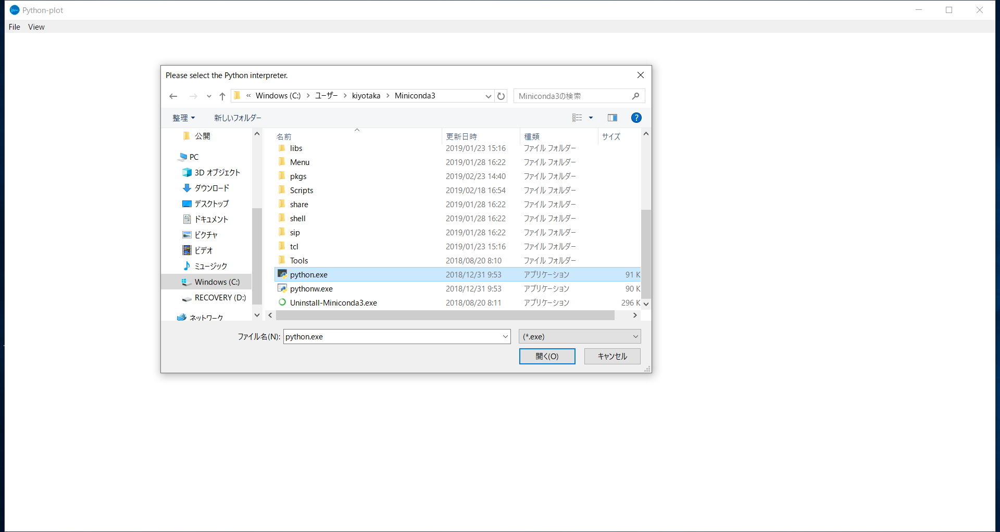
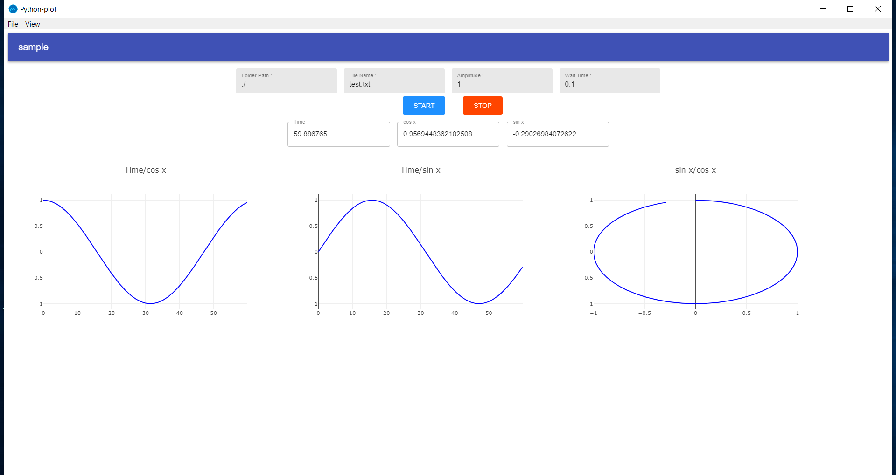

Python-plot
====

## Overview
このプログラムは、Pythonを用いて測定等のグラフ描画が必要なプログラムを書く際、グラフ描画と必要なパラメータの取得が簡単に行えるようにするためのプログラムです。

## Install
[Releases](https://github.com/kytk-03/Python-plot/releases)から最新版をダウンロードしてください。

## Usage
ダウンロードしたzipファイルを展開し、Python-plot.exeを起動してください。
起動するとまず、Pythonの実行ファイルのPathが尋ねられます。Anaconda等の仮想環境上のPythonを指定することもできます。2回目以降起動すると、初めに指定されたPythonが選択された状態でスタートします。変更したい場合はmenu barのFileからChange Python Pathを選択して変更できます。


初回起動時はsample画面が表示されます。


このプログラムを用いて実際の測定を行うには、setting.txtとmeasurement.pyの2つのファイルが必要となります。
sampleのsetting.txtとmeasurement.pyは以下のようになっています。

sample/setting.txt
```
Folder Path,File Name,Amplitude,Wait Time
Time,cos x,sin x
Time/cos x,Time/sin x,sin x/cos x
```

sample/measurement.py
```python
import time
from datetime import datetime
import json
import sys
import math
import os

input = json.loads(sys.stdin.readline())
with open(input["Folder Path"] + os.sep + input["File Name"], "a") as f:
    f.write("Time\tSin x\tCos x\n")

starttime = datetime.now()

while True:
    elapsedtime = (datetime.now()-starttime).total_seconds()
    sin = float(input["Amplitude"])*math.sin(elapsedtime/10)
    cos = float(input["Amplitude"])*math.cos(elapsedtime/10)
    output = {"sin x": sin, "cos x": cos, "Time": elapsedtime}
    print(json.dumps(output))
    with open(input["Folder Path"] + os.sep + input["File Name"], "a") as f:
        f.write(str(elapsedtime) + "\t" + str(sin) + "\t" + str(cos) + "\n")
    time.sleep(float(input["Wait Time"]))
```

setting.txtの1行目にinputとして表示したい項目、2行目にoutputに表示したい項目、3行目にグラフにプロットしたい値をカンマ区切りで指定します。グラフはx軸/y軸のように指定します。

measurement.pyにはinputで指定された値がjson形式の文字列として標準入力におくられます。
```
input = json.loads(sys.stdin.readline())
```
のようにすることで、pythonの辞書として読み取ることができます。
outputに値を送るには
```
output = {"sin x": sin, "cos x", cos, "Time": elapsedtime}
print(json.dumps(output))
```
のように書くことで値が表示されます。

setting.txtとmeasurement.pyを一つのフォルダにまとめたうえでmenu barのFileからImport Experimentを選択し、setting.txtとmeasurement.pyが入ったフォルダを選択することで、測定に必要なInput、Output、グラフが表示されます。

## Licence
This software is released under the MIT License, see LICENSE.
